# AWS Terraform DevOps Project

End-to-end Infrastructure as Code (IaC) project provisioning a production-style AWS environment using Terraform, with a full CI/CD pipeline (Jenkins + GitHub Actions), automated PR-based infrastructure workflows via Atlantis, and security scanning with Checkov.

## 📌 Overview

This project demonstrates a complete DevOps workflow for managing AWS infrastructure:

- **Infrastructure as Code** — AWS resources (VPC, Subnets, EC2, Load Balancer, Security Groups, IAM) provisioned entirely via Terraform
- **CI/CD Automation** — Terraform fmt, validate, plan, and apply automated through Jenkins and GitHub Actions
- **PR-based Infra Workflow** — Atlantis integration for plan/apply directly from pull requests
- **Security Scanning** — Static analysis of Terraform code using Checkov to catch misconfigurations before deployment

## 🏗️ Architecture

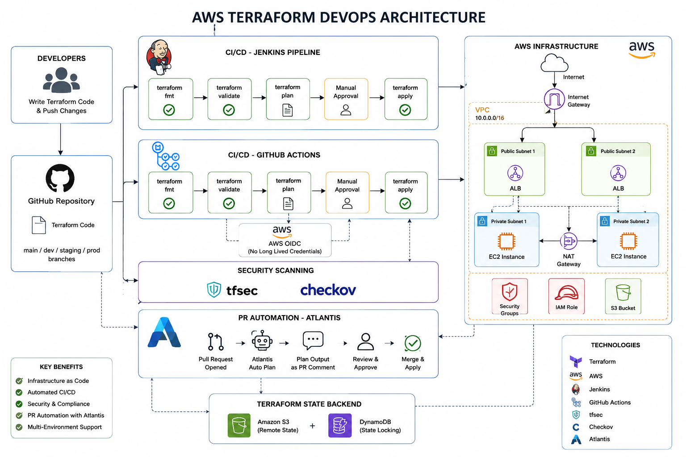

## High-Level Flow

Developer
↓
GitHub Repository
↓
Jenkins / GitHub Actions
↓
Terraform
↓
AWS Infrastructure

AWS Infrastructure includes:

- VPC
- Public and Private Subnets
- Internet Gateway
- NAT Gateway
- Route Tables
- Application Load Balancer
- EC2
- Security Groups
- IAM Role
- S3
- Terraform Remote State

---

## 📂 Repository Structure

aws-terraform-devops/
├── .github/workflows/     # GitHub Actions CI/CD pipelines
├── terraform/             # Terraform IaC code (VPC, EC2, ALB, IAM, SG)
├── docs/docs/screenshots/ # Setup & pipeline screenshots
├── Jenkinsfile            # Jenkins pipeline definition
├── atlantis.yaml          # Atlantis PR automation config
├── checkov-report.txt     # Initial security scan report
├── checkov-final.txt      # Post-fix security scan report
├── .gitignore
└── LICENSE

---
# 🔐 Security

Security practices implemented in the project:

- IAM Role based AWS access
- S3 public access blocking
- S3 encryption
- S3 versioning
- Terraform state protection
- Security Group least-privilege rules
- IMDSv2 enabled on EC2
- tfsec scanning
- Checkov scanning
- GitHub OIDC authentication
- Terraform PR automation

---

# 🛠️ Technologies Used

- AWS
- Terraform
- Linux
- Git
- GitHub
- Jenkins
- GitHub Actions
- Docker
- tfsec
- Checkov
- Atlantis
- S3
- IAM
- VPC
- EC2
- Application Load Balancer

---

## # 📌 Project Phases (Screenshots)

## Phase 1 — Terraform Foundation

Covered:

- Terraform installation and configuration
- AWS Provider
- Variables
- Outputs
- Resources
- terraform init
- terraform fmt
- terraform validate
- terraform plan
- terraform apply
- terraform destroy

### Proof
Terraform installed and configured, with provider setup and initial workflow (`init`, `plan`, `apply`) verified successfully.

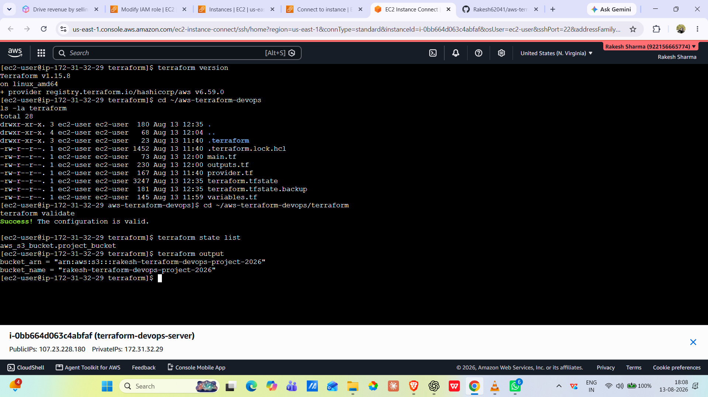

The core Terraform commands executed end-to-end — plan generated and applied without errors, confirming the foundation setup works correctly.

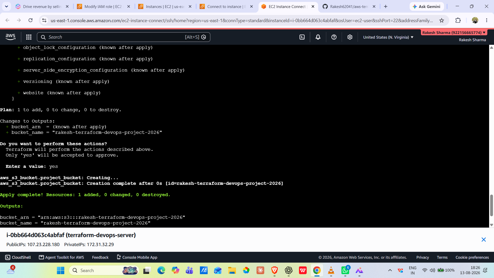

---

## Phase 2 — AWS Infrastructure

Created AWS infrastructure using Terraform.

### Infrastructure

- VPC: `10.0.0.0/16`
- 2 Public Subnets
- 2 Private Subnets
- Internet Gateway
- Public Route Table
- Private Route Table
- NAT Gateway
- Elastic IP
- Application Load Balancer
- Target Group
- ALB Listener
- EC2
- Security Groups
- IAM Role and Instance Profile
- S3 Bucket
Complete VPC setup with public/private subnets, route tables, and internet gateway — visualized here via the AWS VPC resource map.

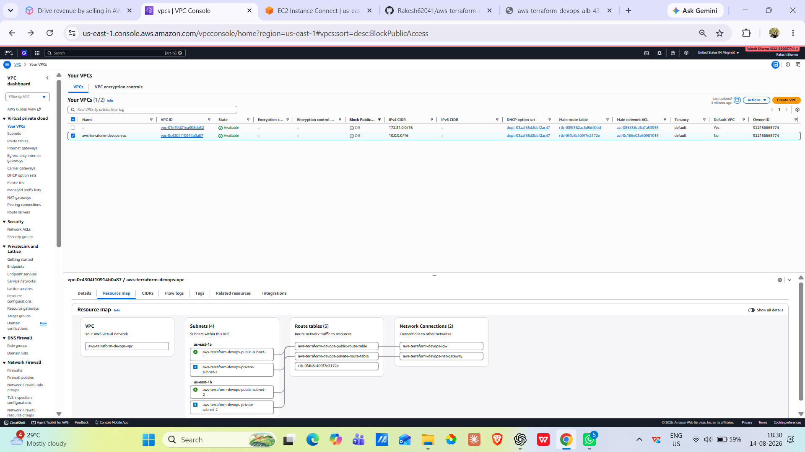

NAT Gateway provisioned to allow private subnet instances outbound internet access without exposing them publicly.

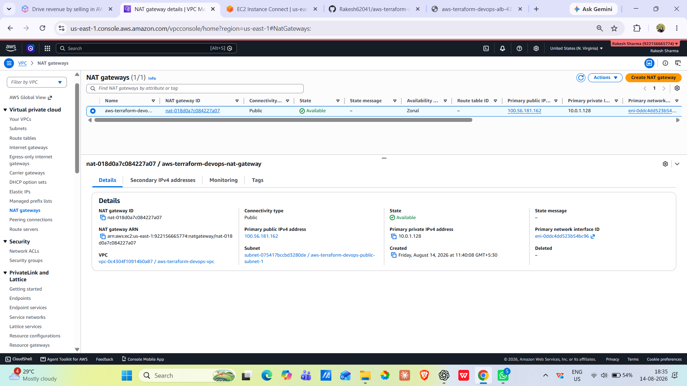

IAM Role attached to the EC2 instance, following least-privilege principles for secure access to AWS services.

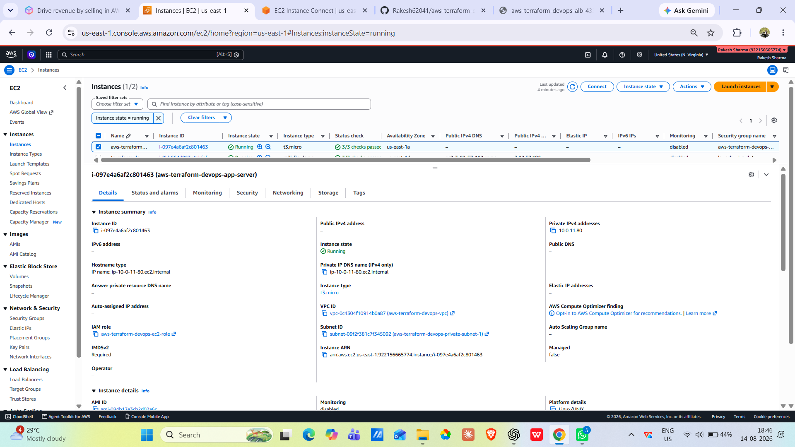

Application Load Balancer target group showing healthy EC2 instances — confirming the ALB health checks and routing are working correctly.

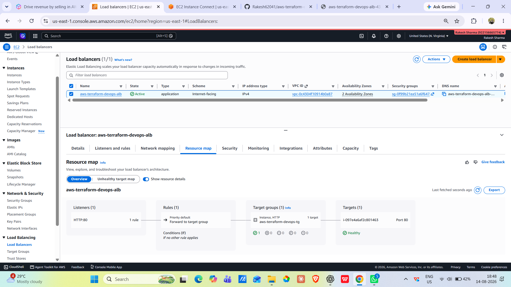

---

## Phase 3 — Terraform Advanced

Covered advanced Terraform concepts:

- `.tfvars`
- Locals
- Data Sources
- `count`
- `for_each`
- Dependencies
- Lifecycle rules
- Sensitive variables
- Terraform State commands

Final `terraform plan` output showing **no changes** — infrastructure state fully matches the code, confirming a clean and drift-free deployment.

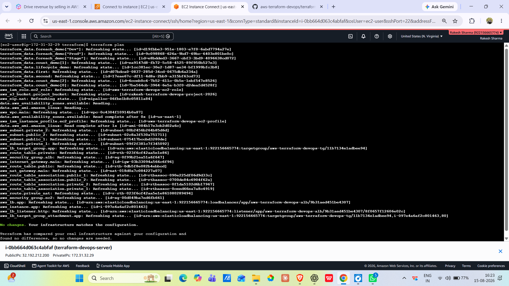

---

## Phase 4 — Terraform Modules

Converted reusable infrastructure into Terraform modules.

### VPC Module

The VPC module contains:

- VPC
- Public Subnets
- Private Subnets
- Internet Gateway
- Public Route Table
- Private Route Table
- Route Table Associations

### Module Validation

Infrastructure refactored into reusable Terraform modules (VPC, EC2, Security Group, ALB) — plan output confirms modules validate and integrate correctly with the root configuration.

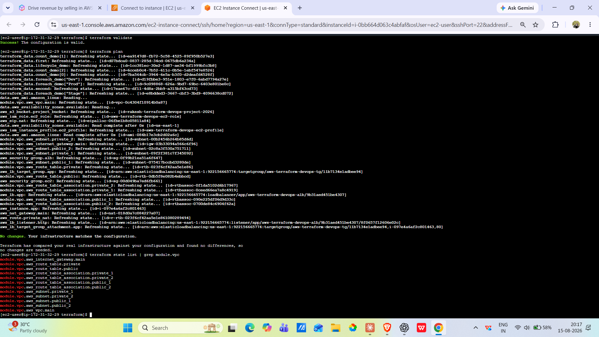

---

## Phase 5 — Terraform State Management

Implemented Terraform remote state concepts.

### Covered

- Terraform State
- Local State vs Remote State
- Amazon S3 Backend
- State Security
- State Locking
- State Versioning
- DynamoDB state locking concept

### S3 Remote State
Remote state backend configured using S3, enabling secure, centralized, and team-shareable state management (with state locking).

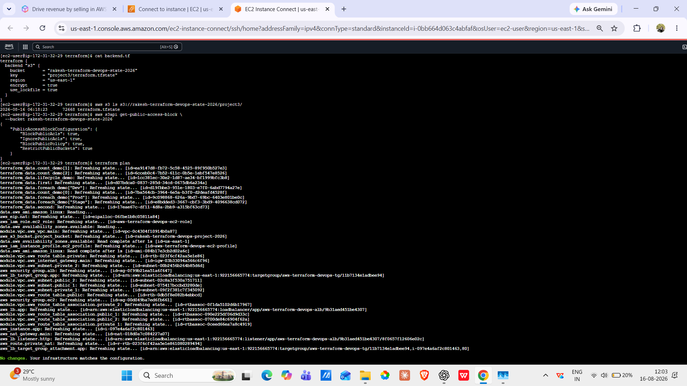

---

## Phase 6 — Terraform Environments

Implemented multiple Terraform environments using the same infrastructure code.

### Environments

- Development
- Staging
- Production

Used:

- Environment-specific `.tfvars`
- Terraform Workspaces
- Separate environment configuration
- Same Terraform code for multiple environments

### Environment Validation
Environment-specific configuration validated — user data scripts and state applied correctly across different `.tfvars` environment setups (dev/staging/prod).

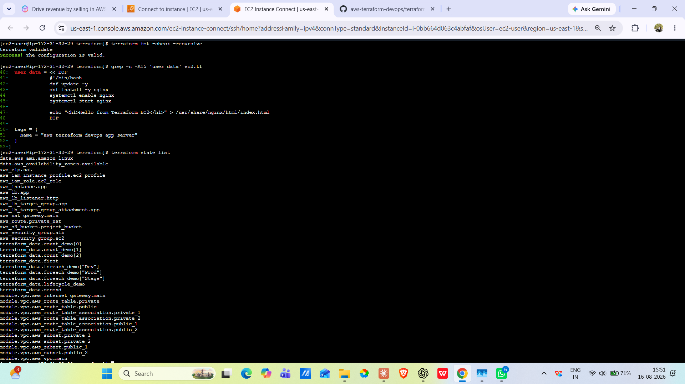

---

# 🚀 Phase 7 — DevOps Automation

Integrated Terraform with DevOps and CI/CD tools.

## Section A — EC2 Bootstrap & Tool Installation

Implemented:

- EC2 User Data
- EC2 Bootstrap
- Docker installation
- Jenkins installation

---

## Section B — GitHub Integration

Implemented:

- GitHub repository
- Terraform source code management
- Git workflow
- Git commit and push
- Jenkins ↔ GitHub integration

---

## Section C — Jenkins Terraform Pipeline

Created a Jenkins pipeline for Terraform automation.

Pipeline stages:

1. Terraform Format
2. Terraform Validate
3. Terraform Plan
4. Manual Approval
5. Terraform Apply

### Jenkins Pipeline

Jenkins pipeline automating the full Terraform workflow — fmt → validate → plan → manual approval → apply — running successfully end-to-end.

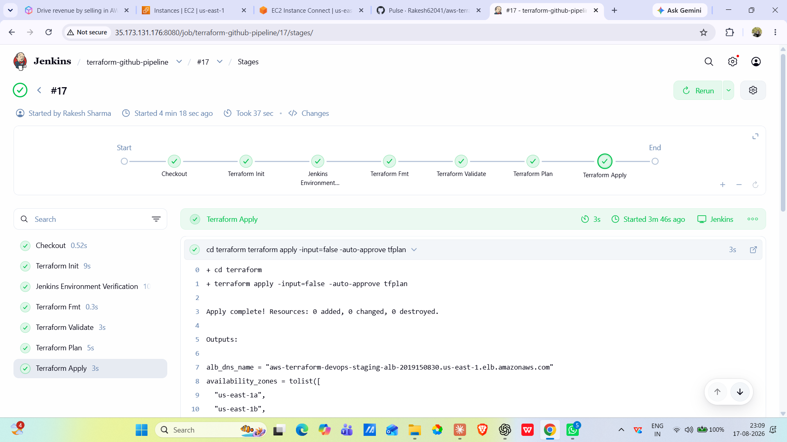

---
## Section D — GitHub Actions

Implemented GitHub Actions for Terraform CI/CD.

Workflow includes:

- Terraform fmt
- Terraform validate
- Terraform plan
- Apply / approval strategy
- AWS authentication using GitHub OIDC

---

## Section E — Terraform Security Scanning

Implemented Infrastructure as Code security scanning using:

- tfsec
- Checkov

Checkov scans Terraform configuration for security and compliance issues before deployment.

### GitHub Actions + Checkov

GitHub Actions workflow with integrated Checkov security scanning — catching misconfigurations automatically before infrastructure changes are applied.

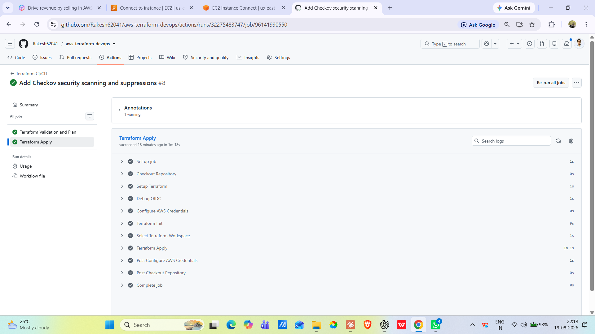
---
## Section F — Terraform PR Automation

Implemented Terraform Pull Request automation using **Atlantis**.

Atlantis workflow:

GitHub Pull Request
↓
Atlantis
↓
Terraform Plan
↓
Review
↓
Terraform Apply

Configured `atlantis.yaml` with:

- Terraform project
- Terraform directory
- Development workspace
- Automatic plan on Terraform changes

### Atlantis PR Automation
Atlantis enabling PR-based infrastructure automation — Terraform plan/apply triggered directly from pull request comments for a fully reviewed GitOps workflow.

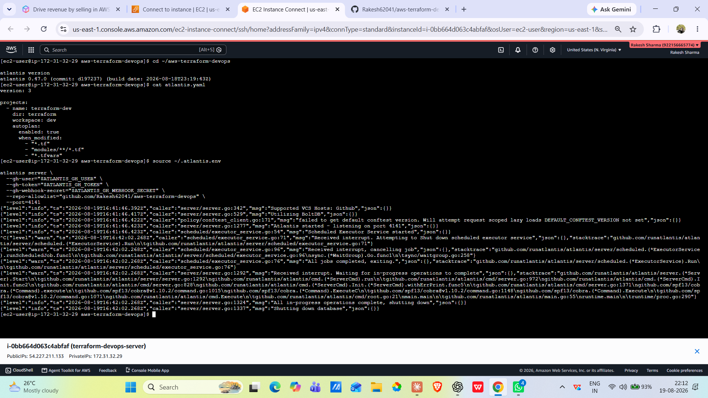
---
## 🛠️ Tech Stack

- **IaC:** Terraform
- **Cloud:** AWS (VPC, EC2, ALB, IAM, Security Groups)
- **CI/CD:** Jenkins, GitHub Actions
- **PR Automation:** Atlantis
- **Security:** Checkov

## 📄 License

This project is licensed under the MIT License — see the LICENSE file for details.

## 👤 Author

**Rakesh Sharma**
GitHub: [@Rakesh62041](https://github.com/Rakesh62041)
